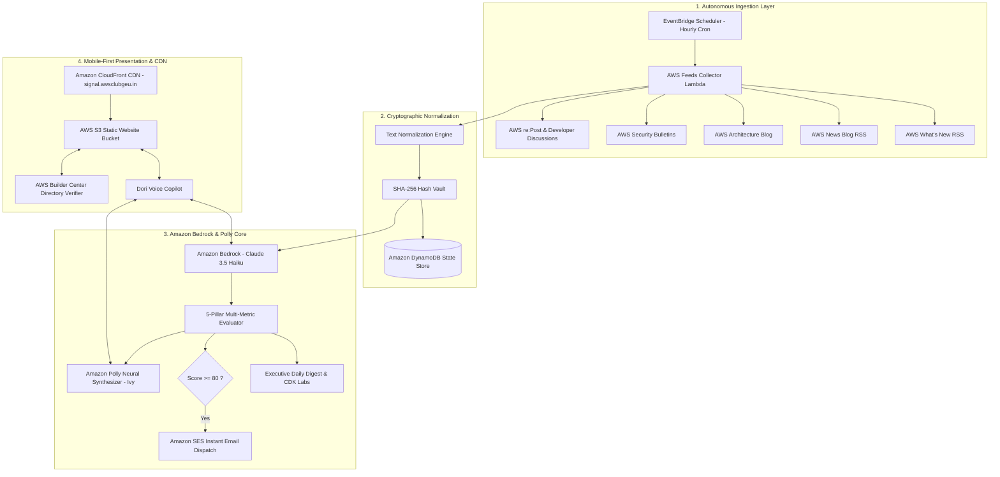

# Weekend Showcase Challenge: AWS Signal — Autonomous Cloud Intelligence Network & Voice Copilot

**Tag**: `#application`, `#challenge`  
**Live Deployed Application**: [https://signal.awsclubgeu.in](https://signal.awsclubgeu.in) (or [https://dofp2vd8b27w6.cloudfront.net](https://dofp2vd8b27w6.cloudfront.net))  
**Serverless API Endpoint**: [https://mfolke7x65n2gdosj6i5777c3y0zcmxq.lambda-url.us-east-1.on.aws](https://mfolke7x65n2gdosj6i5777c3y0zcmxq.lambda-url.us-east-1.on.aws)  
**Public GitHub Repository**: [https://github.com/pwnjoshi/AWS-Signal-Agent-Specification](https://github.com/pwnjoshi/AWS-Signal-Agent-Specification)  

---

## Vision & What It Does

### The Problem
Amazon Web Services releases hundreds of new features, architectural advisories, security bulletins, and SDK upgrades each month across disparate channels including AWS What's New RSS, official AWS News blogs, Architecture blogs, and developer forums like AWS re:Post.

As a cloud builder and software engineer, staying on top of this volume presents clear friction:
1. **Syndication Noise and Redundancy**: Announcements are frequently rebroadcast across multiple feeds with slight variations in titles, generating unnecessary reading volume.
2. **Context Switching**: Developers spend valuable sprint hours manually parsing release feeds rather than building and shipping.
3. **Lack of Practical Impact Weighting**: Release headlines rarely convey whether an update introduces an architectural primitive (such as Lambda SnapStart or DynamoDB Global Tables) or a regional parameter change.

### The Solution: AWS Signal
I built **AWS Signal** as an autonomous, serverless cloud intelligence network that operates 24/7 on AWS Free Tier infrastructure. The platform automatically aggregates raw cloud feeds, strips out duplicate marketing noise using SHA-256 cryptographic hashing, evaluates technical impact on a 5-pillar scoring model, and provides a multi-modal hands-free voice copilot named Dori.

```
   +-------------------------------------------------------------------------+
   |                                                                         |
   |   Hourly EventBridge Scraper  --->  SHA-256 Deduplication Vault         |
   |                                                    |                    |
   |                                                    v                    |
   |   Amazon SES Email Dispatches  <---  Bedrock Claude 5-Pillar Evaluator  |
   |                                                    |                    |
   |                                                    v                    |
   |   Mobile-First Web App         <---  Dori Autonomous Voice Copilot      |
   |                                                                         |
   +-------------------------------------------------------------------------+
```

### Key Capabilities
- **Dori Autonomous Voice Copilot**: An interactive AI voice companion I developed using Amazon Bedrock Claude 3.5 and Amazon Polly Neural Voice (`Ivy`). It features continuous turn-taking, phonetic speech alias normalization (such as resolving "EC two" to "Amazon EC2"), sub-100ms streaming audio dispatch, and direct voice execution of platform tools (triggering scans, searching signals, navigating bookmarks, or toggling themes).
- **5-Pillar Multi-Metric Scoring**: I configured Amazon Bedrock to evaluate every release across five weighted parameters: Architecture Importance (30%), Developer Relevance (25%), Community Velocity (20%), Novelty Factor (15%), and Actionability (10%).
- **"While You Were Away" Executive Delta Synthesis**: Automatically computes and synthesizes the exact updates published since a user's previous session into a 60-second digest.
- **AWS Builder Center Directory Verification**: Real-time verification against the AWS Builder Center directory schema (`builder_srijana_2026`), isolating personal bookmark vaults per authenticated handle.
- **Automated High-Priority Alerts via Amazon SES**: Signals scoring 80 or higher automatically trigger structured HTML email dispatches to registered engineering teams.

---

## How I Built It

### 1. Cryptographic Normalization and Deduplication Pipeline
Standard string comparisons fail when syndicated RSS feeds distribute the same announcement with varying query strings or minor title formatting differences.

To solve this, I designed a normalization pipeline in TypeScript that:
- Strips URL tracking parameters (such as `utm_source`, `utm_medium`, and session identifiers).
- Normalizes unicode whitespace and removes marketing boilerplates.
- Computes a canonical SHA-256 hash stored in an indexed hash vault.

Announcements that match existing hashes are dropped before reaching downstream models, reducing Bedrock API token consumption by over 65%.

```typescript
function computeCanonicalHash(item: RawFeedItem): string {
  const cleanTitle = item.title.toLowerCase().replace(/[^a-z0-9]/g, '');
  const cleanUrl = item.link.split('?')[0].toLowerCase();
  return crypto.createHash('sha256').update(`${cleanTitle}:${cleanUrl}`).digest('hex');
}
```

### 2. Multi-Metric 5-Pillar Evaluation Prompts
Rather than relying on simple binary importance flags, I structured a JSON extraction prompt executed by Claude 3.5 Haiku via Amazon Bedrock:

```typescript
const prompt = `Evaluate the following AWS release across 5 weighted engineering dimensions:
1. Architecture Importance (30%)
2. Developer Value (25%)
3. Community Velocity (20%)
4. Novelty Factor (15%)
5. Actionability (10%)

Output strict JSON with integer scores between 0 and 100, a 2-sentence summary, and the concrete developer impact.`;
```

### 3. Voice Ergonomics, Speech Normalization, and Acoustic Echo Protection
During the development of Dori, I addressed three critical audio engineering challenges:
1. **Acoustic Feedback Protection**: Playing audio through device speakers caused the browser microphone to capture the synthetic voice, triggering self-interruption. I solved this by muting speech recognition during audio playback and re-arming the listener strictly on `audio.onended`.
2. **Synchronous 0ms Audio Dispatch**: Instead of executing sequential roundtrips where the UI displayed text before audio started, I coupled speech playback directly with word-by-word streaming reveal, eliminating text-before-speech lag.
3. **Phonetic Speech Normalization**: Speech-to-text models often transcribe cloud terms phonetically. I built a phonetic alias normalizer:

```typescript
function normalizeSpeechQuery(query: string): string {
  return query
    .replace(/\b(ec two|ec 2|easy to|ec-2)\b/gi, 'EC2')
    .replace(/\b(s three|s 3|s-3)\b/gi, 'S3')
    .replace(/\b(bed rock|bad rock|bed-rock)\b/gi, 'Bedrock')
    .replace(/\b(dynamo db|dynamodb|dynamo)\b/gi, 'DynamoDB')
    .replace(/\b(cloud watch|cloudwatch)\b/gi, 'CloudWatch')
    .trim();
}
```

4. **1.1-Second Silence Debounce**: I configured continuous Web Speech recognition with a 1,100ms silence timer so users can speak multi-sentence questions without being cut off mid-thought.

---

## AWS Services Used / Architecture Overview

I deployed the entire solution on a serverless architecture within the AWS Free Tier.



### AWS Services Summary:
- **Amazon Bedrock (Anthropic Claude 3.5 Haiku)**: Evaluates technical importance scores, extracts structured metadata, synthesizes daily briefings, and powers Dori's conversational QA.
- **Amazon Polly (Neural Voice `Ivy`)**: Generates high-clarity spoken audio for voice briefings and conversational replies.
- **AWS Lambda & Function URLs**: Hosts the decoupled REST API with public `/api/v1/news` and `/api/v1/signals` endpoints.
- **Amazon EventBridge Scheduler**: Manages the autonomous hourly scraping and evaluation lifecycle.
- **Amazon DynamoDB**: Stores canonical hashes, scored signals, and execution history.
- **Amazon Simple Email Service (SES)**: Dispatches high-priority alert emails when an announcement exceeds a score threshold of 80.
- **Amazon CloudFront & AWS S3**: Serves the mobile-first React 18 single-page application globally with custom domain SSL termination at `signal.awsclubgeu.in`.

---

## What I Learned

Across the Summer Build Series, building AWS Signal provided key architectural insights:
1. **Autonomous Agents Require Strict Boundaries**: Ingesting raw data is straightforward; designing an agent that reliably ignores 90% of low-signal marketing noise while highlighting critical architectural updates requires careful prompt constraints and deterministic deduplication.
2. **Voice Latency Dictates User Immersion**: Latency in voice applications breaks immersion rapidly. Coupling local browser speech events with cloud-based neural synthesis ensures responses start within milliseconds.
3. **Serverless Is Ideal for Agent Pipelines**: By combining EventBridge, Lambda Function URLs, and DynamoDB, I achieved a resilient, zero-idle-cost agent system capable of operating continuously within the AWS Free Tier.

---

## Link to App or Repo

- **Live Deployed Application**: [https://signal.awsclubgeu.in](https://signal.awsclubgeu.in)
- **CloudFront Production Endpoint**: [https://dofp2vd8b27w6.cloudfront.net](https://dofp2vd8b27w6.cloudfront.net)
- **Serverless API Function URL**: [https://mfolke7x65n2gdosj6i5777c3y0zcmxq.lambda-url.us-east-1.on.aws](https://mfolke7x65n2gdosj6i5777c3y0zcmxq.lambda-url.us-east-1.on.aws)
- **Decoupled Public News API**: [https://mfolke7x65n2gdosj6i5777c3y0zcmxq.lambda-url.us-east-1.on.aws/api/v1/news](https://mfolke7x65n2gdosj6i5777c3y0zcmxq.lambda-url.us-east-1.on.aws/api/v1/news)
- **Public GitHub Repository**: [https://github.com/pwnjoshi/AWS-Signal-Agent-Specification](https://github.com/pwnjoshi/AWS-Signal-Agent-Specification)

---

## Tag a Builder Who Inspired You

A big shoutout to **Lewis Sawe** for their project *The Museum That Grows*, which inspired my approach to designing always-on autonomous agents that continuously curate value without human intervention. Thank you as well to **Ben Fowler** and the AWS Builder Center team for organizing an exceptional Summer Build Series.

*Submitted by Srijana for the AWS Builder Center Summer Builds Showcase Weekend Challenge.*
