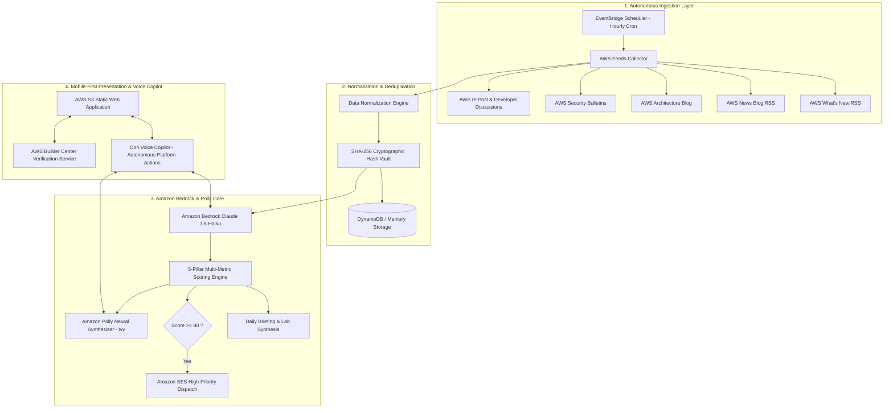

# ⚡ AWS Signal — Autonomous Cloud Intelligence Platform

[](https://aws.amazon.com/bedrock/)
[](https://aws.amazon.com/polly/)
[](https://aws.amazon.com/lambda/)
[](https://aws.amazon.com/ses/)
[](https://reactjs.org/)
[](https://www.typescriptlang.org/)
[](LICENSE)

**AWS Signal** is a production-grade autonomous cloud intelligence platform powered by **Amazon Bedrock (Anthropic Claude 3.5)**, **Amazon Polly Neural Voice (`Ivy`)**, **AWS Lambda**, **Amazon SES**, and **AWS Builder ID Verification**. It continuously monitors hundreds of AWS release feeds, eliminates duplicate marketing noise using SHA-256 cryptographic hashing, evaluates developer impact on a 5-pillar multi-metric scale, and provides an **Autonomous Voice Copilot (Dori)** for hands-free cloud operations.

---

## 🌐 Live AWS Production Endpoints

| Resource | Live Production URL | Description |
| :--- | :--- | :--- |
| 🌐 **Web Application** | **[http://aws-signal-web-013131247228.s3-website-us-east-1.amazonaws.com](http://aws-signal-web-013131247228.s3-website-us-east-1.amazonaws.com)** | Mobile-first React 18 + Vite SPA hosted on AWS S3 Static Website Hosting |
| ⚡ **Serverless API** | **[https://mfolke7x65n2gdosj6i5777c3y0zcmxq.lambda-url.us-east-1.on.aws](https://mfolke7x65n2gdosj6i5777c3y0zcmxq.lambda-url.us-east-1.on.aws)** | Bundled Node.js Express Lambda Function URL |
| 📖 **Decoupled API v1** | **[https://mfolke7x65n2gdosj6i5777c3y0zcmxq.lambda-url.us-east-1.on.aws/api/v1/news](https://mfolke7x65n2gdosj6i5777c3y0zcmxq.lambda-url.us-east-1.on.aws/api/v1/news)** | Public REST API for third-party systems to fetch normalized AWS intelligence |
| 🐙 **GitHub Repository** | **[https://github.com/pwnjoshi/AWS-Signal-Agent-Specification](https://github.com/pwnjoshi/AWS-Signal-Agent-Specification)** | Complete monorepo with client, server, collectors, and cloud CDK specs |

---

## 🏛️ System Architecture



---

## 🌟 Core System Capabilities

### 🤖 1. Dori — Autonomous Voice Copilot
- **Continuous Hands-Free Turn-Taking**: Dori listens, synthesizes answers using Amazon Polly Neural Voice (`Ivy`), and automatically re-arms the microphone upon completion with zero button clicks required.
- **Acoustic Feedback Protection**: The microphone is automatically muted during speech playback so Dori never listens to herself or self-interrupts.
- **Speech Query Alias Normalizer**: Intelligently resolves spoken phonetic terms (`"EC two"`, `"EC 2"`, `"easy to"` $\rightarrow$ `Amazon EC2`; `"S three"` $\rightarrow$ `Amazon S3`; `"Bed rock"` $\rightarrow$ `Amazon Bedrock`).
- **Autonomous Platform Voice Control**: Dori can execute live platform actions via voice:
  - *"Scan feeds"* / *"Run pipeline"* $\rightarrow$ Triggers live background ingestion.
  - *"Search for Lambda"* $\rightarrow$ Filters live radar matrix.
  - *"Open vault"* / *"Show bookmarks"* $\rightarrow$ Navigates to personal saved articles.
  - *"Switch theme"* $\rightarrow$ Toggles dark/light mode.

### 🛡️ 2. AWS Builder Center Directory Verification & Vault Isolation
- **Real-Time Directory Lookup**: Verifies handle syntax and queries the **AWS Builder Center Directory** before granting access.
- **Strict Account Vault Isolation**: Saved articles and custom alert preferences are partitioned per handle (`aws_signal_saved_ids_<builder_id>`).
- **1-Click Clean Logout**: Instant session termination and storage reset to guest mode.

### 📊 3. 5-Pillar Bedrock Multi-Metric Evaluation
Raw announcements are evaluated across 5 weighted dimensions on a 0–100 scale:
1. **Architecture Importance (30%)**: Long-term structural impact on cloud infrastructure.
2. **Developer Relevance (25%)**: Daily engineering and developer workflow value.
3. **Community Velocity (20%)**: Discussion momentum across re:Post and dev forums.
4. **Novelty Factor (15%)**: Uniqueness versus existing cloud feature sets.
5. **Actionability (10%)**: Immediate hands-on migration or implementation capability.

### 📱 4. Mobile-First Native Smartphone UX + Desktop Bento Grid
- **Mobile Smartphone**: Fixed frosted-glass bottom dock (`MobileBottomNav`), haptic active indicators, minimum 44px touch targets, safe-area inset padding (`env(safe-area-inset-bottom)`), and responsive single-column touch cards.
- **Desktop Widescreen**: 12-column Bento Grid, 5-step horizontal pipeline, and comprehensive metric dashboards.
- **Automatic `ScrollToTop`**: Smoothly resets scroll position to `(0, 0)` on every route transition.

---

## 🔌 Decoupled Public REST API Reference

All endpoints return standardized JSON and are protected with sliding-window rate limiters.

### Public Ingestion Endpoints (No Auth Required)

#### `GET /api/v1/news`
Returns raw, normalized AWS news items collected across public feeds.
```bash
curl -X GET "https://mfolke7x65n2gdosj6i5777c3y0zcmxq.lambda-url.us-east-1.on.aws/api/v1/news?limit=10"
```

#### `GET /api/v1/signals`
Returns Bedrock-ranked signals with 5-pillar evaluation scores.
```bash
curl -X GET "https://mfolke7x65n2gdosj6i5777c3y0zcmxq.lambda-url.us-east-1.on.aws/api/v1/signals?minImportance=80&service=AWS%20Lambda"
```

#### `GET /api/v1/briefings/latest`
Returns the latest daily synthesized executive digest and practical hands-on lab.
```bash
curl -X GET "https://mfolke7x65n2gdosj6i5777c3y0zcmxq.lambda-url.us-east-1.on.aws/api/v1/briefings/latest"
```

#### `GET /api/v1/trends`
Returns active community discussion topics and friction scores.
```bash
curl -X GET "https://mfolke7x65n2gdosj6i5777c3y0zcmxq.lambda-url.us-east-1.on.aws/api/v1/trends"
```

### Voice & Verification Endpoints

#### `POST /api/dori/ask`
Real-time grounded Question Answering with multi-turn context and Amazon Polly synthesis.
```bash
curl -X POST "https://mfolke7x65n2gdosj6i5777c3y0zcmxq.lambda-url.us-east-1.on.aws/api/dori/ask" \
  -H "Content-Type: application/json" \
  -d '{"question": "What is new with Lambda SnapStart today?", "synthesizeAudio": true}'
```

#### `POST /api/auth/builder-id`
Validates handle against the AWS Builder Center directory and creates an isolated session.
```bash
curl -X POST "https://mfolke7x65n2gdosj6i5777c3y0zcmxq.lambda-url.us-east-1.on.aws/api/auth/builder-id" \
  -H "Content-Type: application/json" \
  -d '{"builder_id": "builder_srijana_2026", "display_name": "Srijana", "email": "srijana@builder.aws"}'
```

---

## 🛠️ Local Development Setup

### Prerequisites
- Node.js 18+ & npm
- AWS CLI configured with credentials (`aws configure`)

### 1. Clone & Install Dependencies
```bash
git clone https://github.com/pwnjoshi/AWS-Signal-Agent-Specification.git
cd AWS-Signal-Agent-Specification

# Install server dependencies
cd server && npm install

# Install client dependencies
cd ../client && npm install
```

### 2. Environment Configuration
Create `.env` in `server/`:
```env
PORT=3001
AWS_REGION=us-east-1
AWS_PROFILE=cloudblueprint
BEDROCK_MODEL_ID=anthropic.claude-3-haiku-20240307-v1:0
CRON_SCHEDULE=0 * * * *
API_KEY=aws-signal-secret-key-2026
```

### 3. Run Development Servers
```bash
# Terminal 1: Run Express & Autonomous Scheduler Server
cd server
npm run dev

# Terminal 2: Run Vite React Frontend (Accessible at http://localhost:3000)
cd client
npm run dev
```

### 4. Build for Production
```bash
# Build Server
npm run build --prefix server

# Build Client
npm run build --prefix client

# Deploy Client to AWS S3 Static Website Hosting
aws s3 sync client/dist s3://aws-signal-web-013131247228/ --region us-east-1
```

---

## 📄 License & Attribution

Distributed under the **MIT License**. See `LICENSE` for details.  
All Amazon Web Services trademarks, logos, and service names belong to Amazon.com, Inc. or its affiliates.
